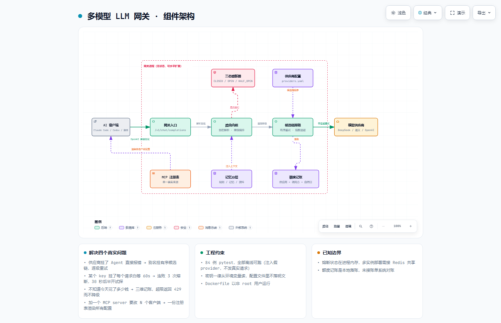

# my-ai-gateway · 多模型 LLM 网关

把多个 LLM 供应商收敛成一个 OpenAI 兼容入口，解决**多 Agent 共用多家模型**时的四个真实问题：

| 问题 | 这里的解法 |
|---|---|
| 供应商挂了，Agent 直接报错 | **失败降级**：一个模型别名后面挂有序候选链，逐级重试 |
| 某个 key 挂了，每个请求都白等 60s 超时 | **熔断**：连续失败 3 次直接跳过，30 秒后半开试探 |
| 不知道今天花了多少钱、谁在烧钱 | **额度记账**：按 provider / 调用方 / 自然日三维落账，含成本估算 |
| 加一个 MCP server 要改 N 个客户端的配置 | **MCP 单一事实来源**：一份注册表渲染成各客户端配置，自动查工具名冲突 |
| 多个 AI 客户端上下文约束不同步 | **记忆分层**：L1 规则层（必读）/ L2 记忆层（近 N 天）/ L3 资料层（只给检索指引） |

## 快速开始

```bash
pip install -e ".[dev]"

# 配好任意一个 provider 的 key 即可跑
export DEEPSEEK_API_KEY=sk-xxx        # Windows: set DEEPSEEK_API_KEY=sk-xxx
python -m uvicorn app.main:app --port 8200

# 或者
python -m app.main
```

## 接口

对外接口**完全兼容 OpenAI**，客户端只改 `base_url` 就能接。

```bash
curl -X POST http://127.0.0.1:8200/v1/chat/completions \
  -H "Content-Type: application/json" \
  -H "X-Caller: my-agent" \
  -d '{"model":"default","messages":[{"role":"user","content":"你好"}]}'
```

| 方法 | 路径 | 说明 |
|---|---|---|
| POST | `/v1/chat/completions` | 对话补全（核心，OpenAI 兼容） |
| GET | `/v1/models` | 可用模型别名列表 |
| GET | `/health` | 存活 + 各 provider 熔断状态 + 路由表 |
| GET | `/admin/usage` | 额度 / 成本 / 失败报表 |
| GET | `/admin/mcp` | MCP 注册表审计（工具名冲突、客户端覆盖） |
| POST | `/admin/mcp/{name}/toggle?enabled=` | 启停某个 MCP server |
| GET | `/admin/mcp/export/{client}` | 渲染成该客户端的 MCP 配置 |
| GET | `/admin/context` | 记忆分层装配预览 |

响应比 OpenAI 多一个 `gateway` 字段，出问题时能一眼看出走了哪条链路：

```json
{
  "choices": [{"message": {"role": "assistant", "content": "..."}}],
  "usage": {"prompt_tokens": 10, "completion_tokens": 5, "total_tokens": 15},
  "gateway": {
    "route": "default",
    "provider": "dashscope",
    "model": "qwen-plus",
    "degraded": true,
    "attempts": [
      {"provider": "deepseek", "model": "deepseek-chat", "ok": false,
       "latency_ms": 30012, "error": "[deepseek] 网络异常: ReadTimeout"},
      {"provider": "dashscope", "model": "qwen-plus", "ok": true, "latency_ms": 812}
    ]
  }
}
```

## 配置

全部外置在 `config/providers.yaml`，换模型/换供应商不动代码。

```yaml
routes:
  default:                       # 模型别名 -> 候选链（按序降级）
    - deepseek:deepseek-chat
    - dashscope:qwen-plus
    - senseaudio:senseaudio-s2
  cheap:                         # 省钱档
    - dashscope:qwen-turbo
    - deepseek:deepseek-chat
budget:
  daily_tokens: 2000000          # 0 = 不限
  per_provider_daily_tokens: 800000
  price_per_1k: {deepseek: 0.001, dashscope: 0.0012}   # 元 / 1K token
breaker_fail_threshold: 3
breaker_recovery_seconds: 30
```

`api_key` 一律从环境变量读，不进配置文件。

> ⚠️ **YAML 坑**：不带引号的 `on` / `off` / `yes` / `no` 会被 YAML 1.1 解析成布尔值，
> 拿来当 provider 名会变成 `True` / `False`。遇到这类命名请加引号：`'off': {...}`。

## 架构



> 可缩放 / 可导出 SVG 的交互版本：[`docs/architecture.html`](docs/architecture.html)
> 图源规格：[`docs/architecture.json`](docs/architecture.json)

```
app/
  config.py         配置加载 + provider 注册表 + 路由表
  schemas.py        对外契约（OpenAI 兼容）+ 异常类型
  providers.py      供应商适配器（统一 OpenAI 协议 + 指数退避重试）
  router.py         路由内核：别名解析 → 熔断准入 → 逐级降级 → 记账
  circuit.py        熔断器三态机 CLOSED/OPEN/HALF_OPEN
  quota.py          额度与成本记账（provider / caller / day 三维）
  mcp_registry.py   MCP 工具链 SSOT：冲突检测 + 多客户端渲染 + 配置往返导入
  memory_layers.py  记忆分层装配 L1/L2/L3
  main.py           FastAPI 入口 + 结构化 JSON 日志
tests/              84 个测试，全部离线可跑（mock provider，不发真实请求）
```

## 设计取舍

**为什么所有供应商都走 OpenAI 兼容协议？**
主流厂商（DeepSeek / 通义 / OpenAI / 各家一体机）都提供了 `/chat/completions` 兼容端点。
收敛到一套协议，适配器只需要一个实现，新增供应商就是加一段配置。

**为什么额度超限不降级、而失败要降级？**
额度超限是运营/配置问题，降级只会把问题藏起来，让人找不到根因——直接 429 暴露。
供应商失败是外部不可控因素，降级是正当的容错。

**为什么 `usage` 缺失也能记账？**
部分兼容端点的响应里没有 `usage` 字段。实现上按 0 记账而不是报错，
保证可用性优先，同时保留 `raw` 响应便于事后核对。

## 测试

```bash
python -m pytest -q          # 84 passed
```

测试通过 `client_factory` 注入假 provider，**不需要网络、不需要真实 key**。
覆盖：首候选成功 / 逐级降级 / 全链路失败 / 降级开关 / max_attempts 截断 /
熔断开启与跳过 / 半开恢复 / 额度超限 / 跨日重置 / 记账与成本 /
MCP 冲突检测与配置往返 / 记忆分层窗口与预算截断 / HTTP 状态码映射。

## 已知边界

- 只支持非流式（`stream=false`）。流式需要逐 chunk 透传并在结束时补记账，尚未实现。
- 熔断状态在进程内存里，多副本部署需换 Redis 之类的共享存储。
- 额度统计是「近似实时」：并发请求下 `check` 与 `record` 之间不保证原子配额。
- 成本估算用的是配置里的单价表，不是账单级精确值。
